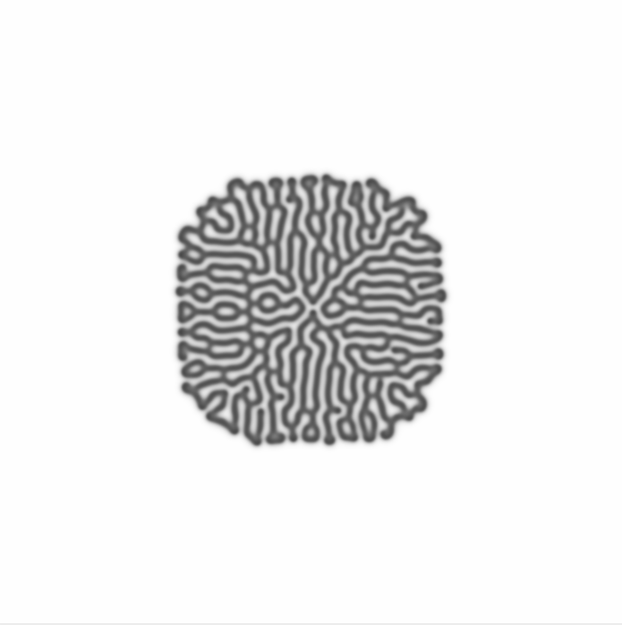

Reaction Diffusion Simulation
---
 

A Python simulation visualizing reaction-diffusion systems using the Gray-Scott Model. 
This simulation demonstrates the fascinating patterns and emergent structures arising from the interaction of two reacting and diffusing chemical species.

    Key Functions:
        reaction(u, v, feed, decay): Implements the core Gray-Scott reaction kinetics, calculating the changes in concentrations of species 'U' and 'V'.
        laplacian(lattice, kernel): Calculates the Laplacian (diffusion) of a given lattice using a finite difference method with convolution.
        dynamics(dt, laplacianKernel, diffusionConstants, u, v, feed, decay): Integrates the reaction and diffusion processes over a time step.

    Parameters:
        diffusionU, diffusionV: Control the diffusion rates of species 'U' and 'V'.
        feed, decay: Influence the pattern generation in the Gray-Scott model.
        N: Determines the size of the simulation lattice.

